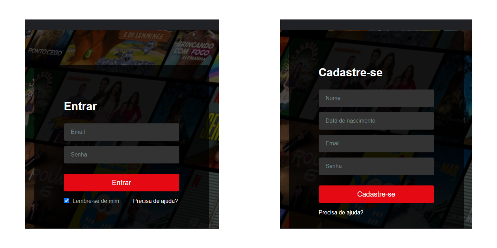

  <h1 style="font-size: 35px;">NinemFlix</h1>
  
Este é um site responsivo clone da Netflix que permite aos usuários fazer login na página. Este projeto foi construído com <a href="https://developer.mozilla.org/pt-BR/">HTML</a>, <a href="https://developer.mozilla.org/pt-BR/">CSS</a>, <a href="https://developer.mozilla.org/pt-BR/docs/Web/JavaScript">JavaScript</a>, <a href="https://legacy.reactjs.org/docs/getting-started.html">React</a> e <a href="https://www.json.org/json-pt.html">json</a>.

  <h2> Visão geral </h2>
  
NinemFlix é um site elegante e fácil de usar. Com uma interface responsiva.

   

  <h3>Versão para mobile</h3>
      
     
  

    

  <h3>Versão para desktop</h3>
      
     
  

  <h2> Recursos </h2>
  
Design responsivo: O site apresenta um design elegante e moderno que é otimizado para dispositivos móveis e desktops. O layout é limpo e intuitivo, com um esquema     de cores agradável e fácil de ler.

  

     
      
     
  

  <h2> Como funciona </h2>
  <ul style="list-style:none; text-decoration:none;" >
    <li>Verifeca se o email é valido</li>
    <li>Verifica se a senha é valida</li>
    <li>Verifica a idade</li>
    <li>Verifica se existe o usuario cadastrado</li>
  </ul>
  

    <h2> Como usar </h2>
    <ul style="list-style:none; text-decoration:none;" >
      <li>Clone o repositório: git clone https://github.com/seu-usuario/seu-repositorio.git</li>
      <li>Carregue os arquivos para um servidor web.</li>
      <li>Acesse o site pelo navegador.</li>
    </ul>
  

  

    <h2> Contribuição </h2>
    
Se você gostaria de contribuir para este projeto, sinta-se livre para abrir uma "issue" ou enviar um "pull request".

  

